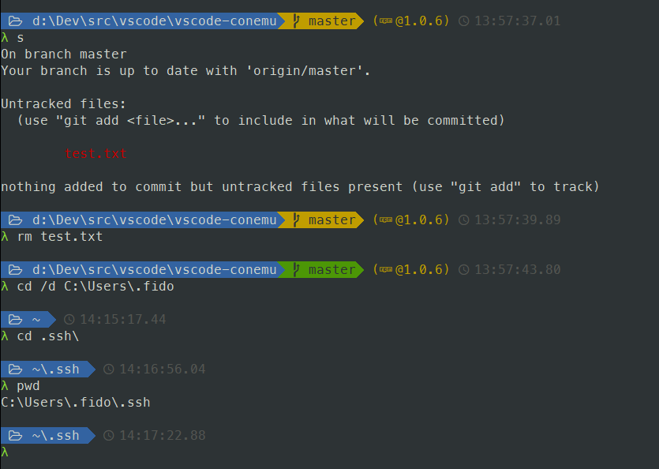
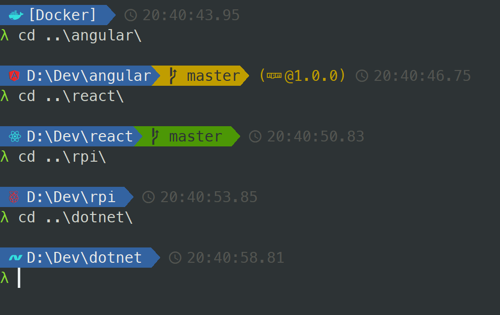
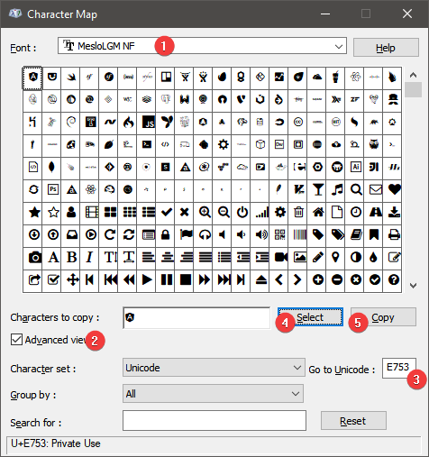

# ConEmu

This is my private compilation of ConEmu adjusted to my preferences. 

It includes the following add-ins:
- [Clink](https://mridgers.github.io/clink/) (thx to Cmder)
- great [clink completions](https://github.com/vladimir-kotikov/clink-completions) for npm, git, among the others
- alias functionality with some predefined stuff
- some additional utilities bundled:
  - [ab.exe](https://en.wikipedia.org/wiki/ApacheBench)
  - curl.exe
  - [datamash.exe](https://www.gnu.org/software/datamash/)
  - [jq.exe](https://stedolan.github.io/jq/tutorial/) (query json from cmd)
  - ~~NLOC.exe~~ cloc.exe to measure lines of code in project
  - TimeMem.exe (UNIX time alike)
  - [xml.exe](http://xmlstar.sourceforge.net/doc/UG/ch04.html) (query xml from cmd)

> Disclaimer: bear in mind that this is my personal customization and hasn't been tested in the field (only my home PC and work machine)  
> If something doesn't work please let me know. I'll try to help.

## Prompt

CMD prompt is also customized:


It's loosely based on [Powerline prompt for Cmder](https://github.com/fredjoseph/cmder-powerline-prompt#cmder---powerline-prompt-for-cmd-shell) which itself is based on Agnoster theme for oh-my-zsh. 
It contains the following segments:

- current working directory (replaced by [~ for user's home dir](https://github.com/fredjoseph/cmder-powerline-prompt#cmd-customizations))
- git information (green when clean, yellow for dirty)
- npm package information `package-name@version` (package-name is omitted when same as current folder name)
- current timestamp

# Installation

1. Install fonts from `fonts` folder
2. Adjust tasks to suit yourself - some of mine will not work for you

## Customization

Apart from that it's possible to set options based on specific directory:


Directory based configuration file is `config/directory_mappings`. There is an example file that could be used as a template: `config/directory_mappings.example`. To get started just rename the example file and start new console in **ConEmu**.

Each line in the file corresponds to one directory and the format is `path = replacement`.
For instance to have custom icon for Windows directory use this:

```
C:\Windows = ESC[3D ESC[37;1;44m
```

Explanation:
- leading and trailing whitespaces are trimmed (around equals sign as well) so multiple configurations can be aligned
- `ESC` literal will be replaced with **ASCII** escape character (see [here](https://docs.microsoft.com/en-us/windows/console/console-virtual-terminal-sequences) for more escape sequences)
- the rectangle just after `ESC[3D` is the actual icon that we want to use (see below on how to get one)
- there is an intentional space after the icon - most of the glyphs available are wider than single character so that's just *padding* so that the icon do not overlap the path
- `ESC[3D` - that's a sequence to move the cursor 3 characters backwards - why 3? To remove the default folder icon and that specific icon has 2 space padding (icon + padding = 3 characters) If you don't want to remove the default icon just skip that sequence
- `ESC[37;1;44m` is a color reset escape sequence. Technically it's not needed here because there was no other escape sequence here to change the default color. However as already mentioned leading and trailing whitespaces are trimmed so without that the space after the icon would be trimmed. That's a tricky *no-op* to avoid that :)
- whole part from the left side of the `=` sign will be replaced with the right side which means one could use is to alias directory names (ie. `C:\git\repos\Projects = [Projects]` could be used to make the path shorter). If all you want is to add an icon you have to repeat the whole directory name on the right side as well (see example file)

### Getting the icon from the font

Those beautiful icons are only visible using one of the NerdFonts so in normal editor they will be presented as rectangle character. How to work with that?

1. [Find](https://www.nerdfonts.com/cheat-sheet) the icon you'd like to use and copy/remember the Unicode value (`e753` for Angular)
2. Run `charmap.exe` (Character Map) in Windows
3. Select **MesloLGM NF** font
4. Enable **Advanced view**
5. Type in Unicode (**#3** on the image below)
6. Alternatively just look up the icon here but the UX is not the best...
6. Click **Select** button, character should get copied to the input field
7. Either click **Copy** or just manually select and copy the character from the input field
8. Open `config/directory_mappings` file in editor which supports Unicode (I use VSCode for that but Notepad++ or others will do as well)
9. Just paste the character in desired place - `Ctrl+V`



# Credits

* Meslo LG M NerdFonts - https://www.nerdfonts.com/#home
* [Cmder - Powerline prompt](https://github.com/fredjoseph/cmder-powerline-prompt) - thanks for inspiration
